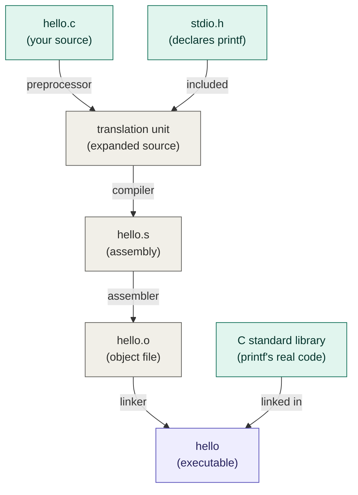

# The C compilation pipeline

How a single `.c` source file becomes a runnable executable. The command
`gcc hello.c -o hello` runs all four stages at once and cleans up the
intermediate files, but each stage can be stopped and inspected on its own.

**Legend:** teal = inputs you provide, gray = throwaway intermediate files,
purple = the final executable.

## Stopping after each stage

Each `gcc` flag halts the pipeline after one of the arrows above, letting you
see the intermediate file it produces.

| Flag   | Stops after  | Produces                                      |
| ------ | ------------ | --------------------------------------------- |
| `-E`   | preprocessor | expanded source (translation unit) on stdout  |
| `-S`   | compiler     | `hello.s` — assembly text                      |
| `-c`   | assembler    | `hello.o` — object file (machine code)         |
| (none) | linker       | `hello` — the executable                       |
