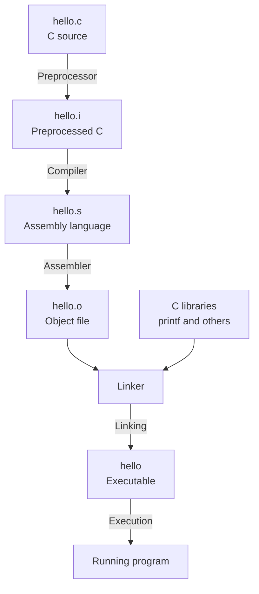

```mermaid
flowchart TD
    A["hello.c<br/>C source"]
    B["hello.i<br/>Preprocessed C"]
    C["hello.s<br/>Assembly language"]
    D["hello.o<br/>Object file"]
    E["C libraries<br/>printf and others"]
    F["Linker"]
    G["hello<br/>Executable"]
    H["Running program"]

    A -->|Preprocessor| B
    B -->|Compiler| C
    C -->|Assembler| D
    D --> F
    E --> F
    F -->|Linking| G
    G -->|Execution| H
```

The .i and .s files conceptually exist as stages, but GCC normally does not save them unless requested.
