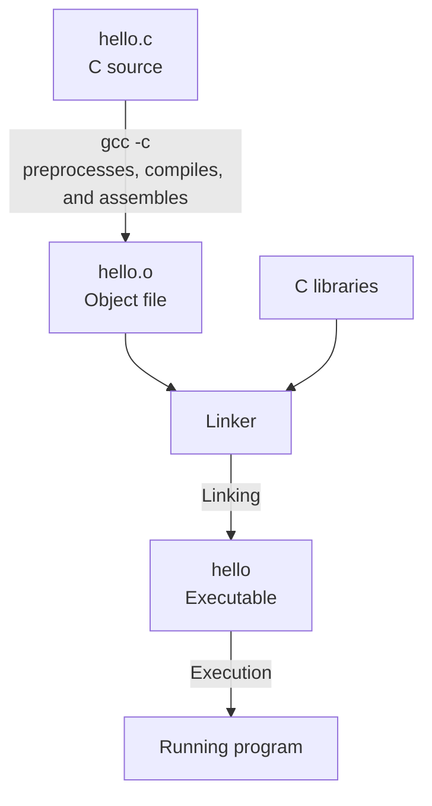

```mermaid
flowchart TD
    A["hello.c<br/>C source"]
    B["hello.o<br/>Object file"]
    C["C libraries"]
    D["Linker"]
    E["hello<br/>Executable"]
    F["Running program"]

    A -->|"gcc -c<br/>preprocesses, compiles, and assembles"| B
    B --> D
    C --> D
    D -->|Linking| E
    E -->|Execution| F
```

Here, one gcc -c command hides three internal stages.

The complete workflow is:
source → preprocessed source → assembly → object file → executable → running program
