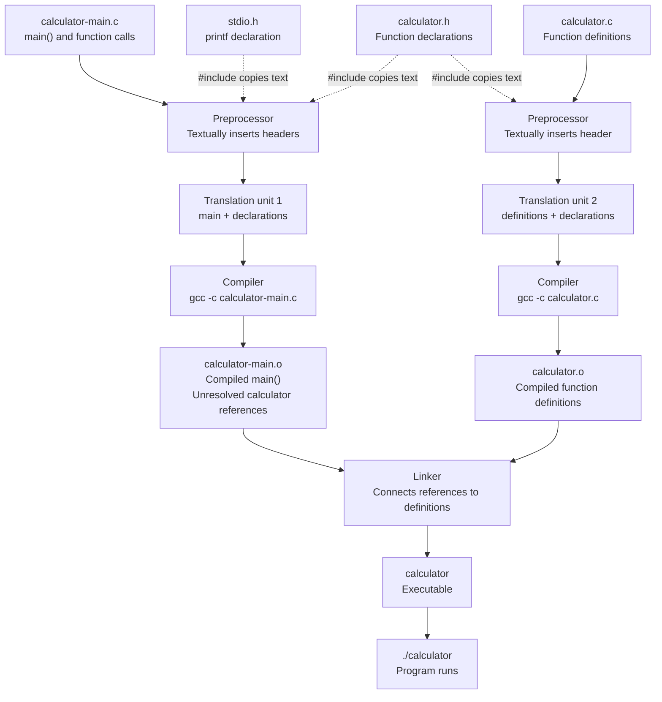

# C compilation pipeline schematic

```mermaid
flowchart TB
    H["calculator.h<br/>Function declarations"]
    S["stdio.h<br/>printf declaration"]

    M["calculator-main.c<br/>main() and function calls"]
    C["calculator.c<br/>Function definitions"]

    P1["Preprocessor<br/>Textually inserts headers"]
    P2["Preprocessor<br/>Textually inserts header"]

    TU1["Translation unit 1<br/>main + declarations"]
    TU2["Translation unit 2<br/>definitions + declarations"]

    CO1["Compiler<br/>gcc -c calculator-main.c"]
    CO2["Compiler<br/>gcc -c calculator.c"]

    O1["calculator-main.o<br/>Compiled main()<br/>Unresolved calculator references"]
    O2["calculator.o<br/>Compiled function definitions"]

    L["Linker<br/>Connects references to definitions"]
    E["calculator<br/>Executable"]
    R["./calculator<br/>Program runs"]

    M --> P1
    H -. "#include copies text" .-> P1
    S -. "#include copies text" .-> P1
    P1 --> TU1
    TU1 --> CO1
    CO1 --> O1

    C --> P2
    H -. "#include copies text" .-> P2
    P2 --> TU2
    TU2 --> CO2
    CO2 --> O2

    O1 --> L
    O2 --> L
    L --> E
    E --> R
```
